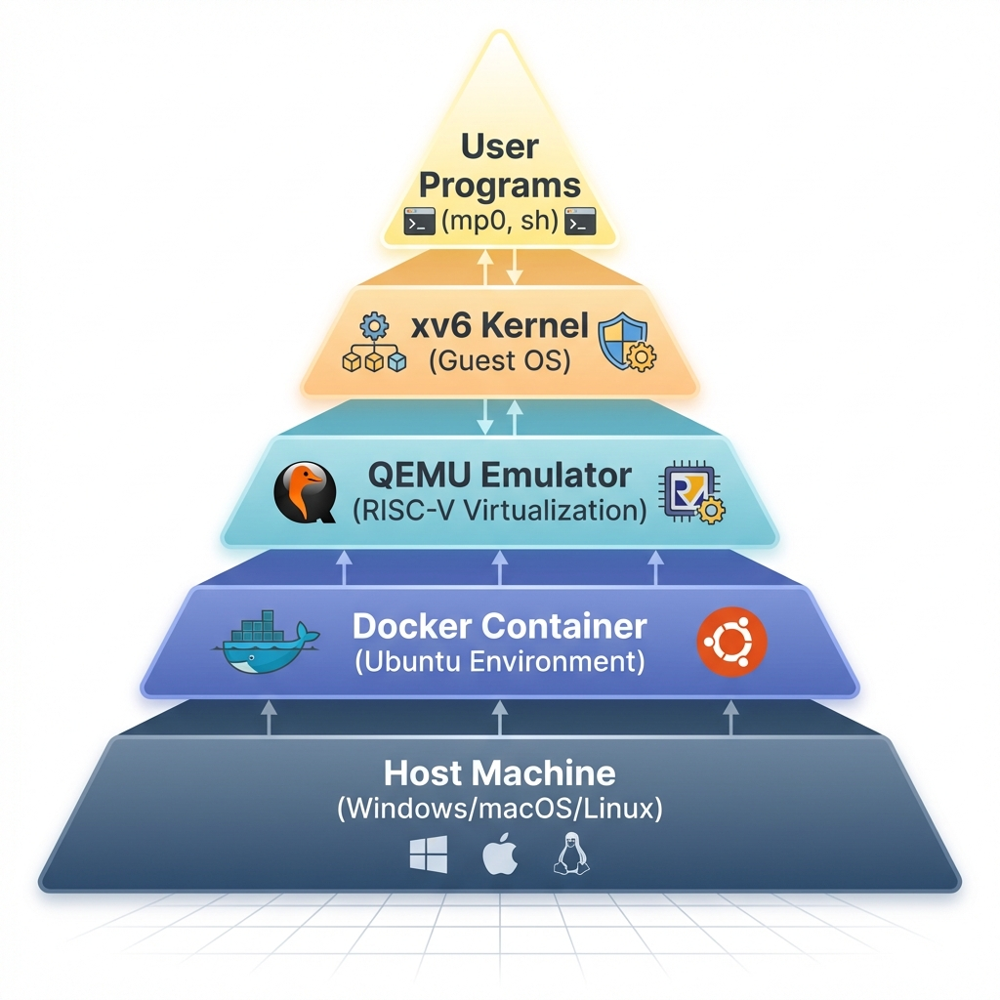

# 📖 Developer Handbook

Technical reference for the `mp.sh` toolkit and the xv6 environment.

## 1. `mp.sh` Interface

The `mp.sh` script is the central hub for managing your Machine Problems.

| Command         | Description                                                               |
| :-------------- | :------------------------------------------------------------------------ |
| `./mp.sh init`  | **Initialization**. Installs Git hooks and sets up the protection system. |
| `./mp.sh qemu`  | **Development**. Compiles the OS and boots it into the QEMU emulator.     |
| `./mp.sh grade` | **Verification**. Runs all tests in the `tests/` directory locally.       |
| `./mp.sh clean` | **Maintenance**. Clears all build artifacts for a fresh start.            |

## 2. QEMU Navigation

Mastering the emulator controls:

- **`Ctrl-p`**: Dump the kernel process table. Invaluable for debugging hangs.
- **`Ctrl-a` then `x`**: Terminate QEMU.
- **`Ctrl-a` then `c`**: Toggle the QEMU console for advanced hardware inspection.

## 3. The Architecture Stack

Understanding the layers of development environment:

| Component        | Role        | Description                                       |
| :--------------- | :---------- | :------------------------------------------------ |
| **User Program** | Application | Programs like `mp0` or `sh` running *inside* xv6. |
| **xv6 Kernel**   | Guest OS    | The RISC-V OS kernel you are modifying.           |
| **QEMU**         | Emulator    | Simulates a full RISC-V computer system.          |
| **Docker**       | Environment | Isolates the dev environment from your host OS.   |
| **Host Machine** | Hardware    | Your physical computer (Windows/macOS/Linux).     |

- **QEMU**: Acts as an emulator and virtualizer. It translates RISC-V instructions generated by your compiled xv6 kernel into instructions that your host CPU can understand.
- **xv6**: The guest operating system running *inside* the emulated environment.



## 4. Technical Details

### Unified Build Process

When you run `./mp.sh qemu` or `./mp.sh grade`, the script mounts your local source code into a pre-configured Docker container. This container contains the cross-compiler (`riscv64-unknown-elf-gcc`) and libraries required to build the xv6 kernel.

### Troubleshooting

- **Zombie Processes**: If your program hangs or zombies appear in `Ctrl-p`, check your `wait()` and `exit()` implementation.
- **Disk Sync**: xv6 uses a virtual disk image (`fs.img`). If it becomes corrupted, use `./mp.sh clean` to reset it.
- **Shared Memory**: Remember that `fork()` creates a copy of the parent's memory. Changes in the parent or child are **not** visible to each other! (Use Pipes as required in assignments).

## 5. Appendix: Environment Details

### Virtualization Strategy: Docker

To run regular operating systems on various host machines, we rely on virtualization. We use **Docker** to verify your code in a standard environment, ensuring that development is independent of your local machine's architecture and OS.

**Why Docker?**

Virtualization provides an abstracted layer from the actual hardware. Here is a comparison between traditional Virtual Machines (VM) and Containers:

| Feature            | Virtual Machine (VM)                          | Container (Docker)                                  |
| :----------------- | :-------------------------------------------- | :-------------------------------------------------- |
| **Architecture**   | Runs a full guest OS on a hypervisor.         | Runs as a discrete process sharing the host kernel. |
| **Resource Usage** | Heavy (requires fixed memory/CPU allocation). | Lightweight (uses what it needs).                   |
| **Boot Time**      | Slow (minutes).                               | Fast (seconds).                                     |
| **Isolation**      | Strong (hardware level).                      | Process level isolation.                            |

#### Supported Platforms

| Platform    | Setup Requirements                                                                                                                                    |
| :---------- | :---------------------------------------------------------------------------------------------------------------------------------------------------- |
| **Linux**   | Native performance. Best experience.                                                                                                                  |
| **Windows** | Requires [Docker Desktop](https://www.docker.com/products/docker-desktop/) with [WSL2](https://docs.microsoft.com/en-us/windows/wsl/install) backend. See [**Windows Tips**](./tips-windows.md). |
| **macOS**   | Requires Docker Desktop. Apple Silicon is fully supported.                                                                                            |

### Emulation Strategy: QEMU and RISC-V

**xv6** is a modern re-implementation of Unix v6, written in ANSI C for a multi-core **RISC-V** system. Since most personal computers run on x86-64 or ARM architectures, we cannot run xv6 directly on the host hardware. We use **QEMU** to bridge this gap.

### Exploring the Filesystem

When you boot xv6 (`./mp.sh qemu`), you interact with the **shell (`sh`)**. You can explore the initial file system generated by `mkfs`:

```bash
$ ls
.              1 1 1024
..             1 1 1024
README         2 2 2059
cat            2 3 24096
echo           2 4 22920
...
mp0            2 18 25664
console        3 19 0
```
