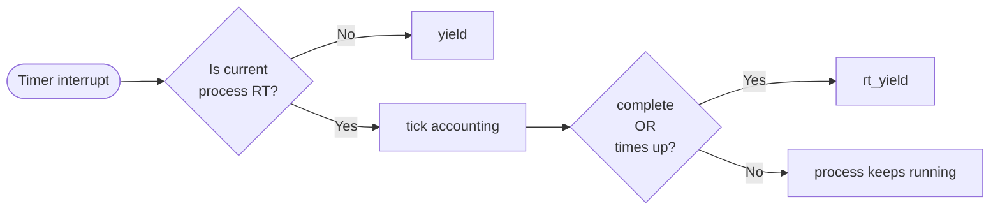
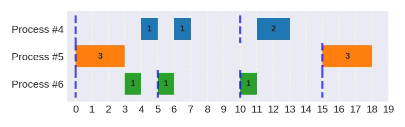
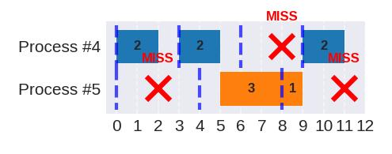
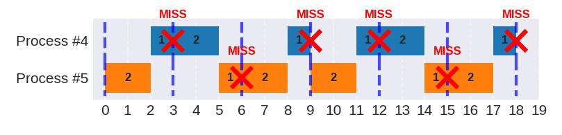

<div align="center">
  <h1>Machine Problem 3 - Real-Time Process Scheduling</h1>
  <h3>CSIE3310 - Operating Systems</h3>
  <h4>National Taiwan University</h4>
</div>

<hr />

<div align="center">
  <table>
    <tr>
      <td><strong>Total Points:</strong></td>
      <td>100</td>
      <td><strong>Release Date:</strong></td>
      <td>April 28</td>
    </tr>
    <tr>
      <td><strong>Due Date:</strong></td>
      <td>May 11, 23:59:59 (UTC+8)</td>
      <td><strong>Late Deadline:</strong></td>
      <td>May 15, 23:59:59 (UTC+8)</td>
    </tr>
    <tr>
      <td><strong>TA Hours:</strong></td>
      <td colspan="3">Wed. 12:30-13:30, Thu. 13:00-14:00 (@CSIE B04)</td>
    </tr>
  </table>
</div>

<hr />

## Table of Contents

- [Discussion Policy](#discussion-policy)
- [Assignment Overview](#assignment-overview)
- [Concepts](#concepts)
- [Grading Policy](#grading-policy)
- [Constraints](#constraints)
- [Part 1 — Tick Accounting (`kernel/trap.c`)](#part-1--tick-accounting-kerneltrapc)
- [Part 2 — Scheduling Algorithms (`kernel/sched.c`)](#part-2--scheduling-algorithms-kernelschedc)
  - [Fixed Priority](#fixed-priority-scheduling)
  - [Earliest Feasible Deadline First](#efdf-earliest-feasible-deadline-first)
  - [Distance Based Priority](#dbp-distance-based-priority)
- [Testing](#testing)
- [References](#references)

## Discussion Policy

If you have any questions regarding this assignment, please post them on the corresponding MP3 discussion board on NTU COOL. For personal questions and requests, please email [ntuos@googlegroups.com](mailto:ntuos@googlegroups.com).

## Assignment Overview

In the default xv6 kernel, every timer interrupt triggers a call to `yield()`, which context-switches to the scheduler. The scheduler then picks the next RUNNABLE process in a simple round-robin fashion. This works for general-purpose systems, but provides **no guarantees** for time-sensitive workloads.

In this assignment, you will replace this behavior with a **real-time (RT) scheduling system**. The key changes are:

1. **Tick accounting in trap handlers**: Instead of blindly calling `yield()` on every timer interrupt, you will implement per-tick bookkeeping for RT processes — tracking how much work they have done and deciding *when* a scheduling decision is needed.
2. **Scheduling algorithms**: You will implement three scheduling algorithms — **Earliest Feasible Deadline First (EFDF)**, **Fixed Priority**, and **Distance Based Priority (DBP)** — that decide *which* RT process to run and *for how long*.

Each RT process is a **periodic task** defined by the following parameters:

| Parameter | Meaning |
|-----------|---------|
| Execution time | Ticks required per cycle |
| Period | Cycle length in ticks (also the relative deadline) |
| Cycles | Number of cycles to execute before terminating |
| Priority | For priority scheduling (lower number = higher priority) |
| Arrival time | Absolute tick when the task first becomes runnable |

An RT process is first released at its **arrival time**, with an initial deadline of **arrival time + period**. It must complete its **execution time** before this deadline. Regardless of whether the current cycle completes, the process is refreshed and begins its next cycle, continuing until all **cycles** are consumed. Each subsequent cycle's deadline equals the previous deadline plus the **period**.

> [!NOTE]
> **Development Environment and Toolchain**:
>
> This assignment utilizes Docker containers and GitHub Actions for automated validation. Before starting, please carefully review:
>
> 1. [`doc/setup.md`](./setup.md): Understand how to initialize the development environment.
> 2. [`doc/workflow.md`](./workflow.md): Learn how to use `./mp.sh grade` to perform local testing and use the git workflows to work and submit your code.

## Concepts

### Timer Interrupts and Ticks

In xv6, timer interrupts are generated periodically by the clock hardware attached to each RISC-V CPU. Xv6 uses this mechanism to maintain its software clock and perform process scheduling. In this MP, we will refer to the time between two subsequent timer interrupts as **1 tick**. The global variable `ticks` in `kernel/trap.c` is incremented by `clockintr()` on each timer interrupt.

### Traps

Trap is a mechanism that allows the system to transfer control to a specific routine when a particular event or condition occurs, such as an exception, a system call, or an interrupt. In xv6, all traps are handled in the kernel, and you can find the two trap handlers: `usertrap` and `kerneltrap` in `kernel/trap.c`. They handle traps from user space and kernel space respectively. It is recommended that you read **Chapter 4** of the [xv6 book](https://pdos.csail.mit.edu/6.828/2023/xv6/book-riscv-rev3.pdf) before you start.

### The Countdown Model

The scheduler does **not** run every tick. Instead, when it dispatches a process, it computes a **time slice** — the number of ticks the process should run before the next scheduling decision. The trap handler decrements this countdown on each tick and only yields when it reaches 0 (or when a cycle completes). This avoids unnecessary context switches and ensures the scheduler only runs when something meaningful happens.

## Grading Policy

### Core Requirements (100%)

- **Public Tests (60%)**
  - **Part 1 — Tick Accounting (10%)**: RT tick accounting in `usertrap()` and `kerneltrap()`.
  - **Part 2 — Priority Scheduling (15%)**: `schedule_priority()` in `kernel/sched.c`.
  - **Part 2 — EFDF Scheduling (15%)**: `schedule_efdf()` in `kernel/sched.c`.
  - **Part 2 — DBP Scheduling (20%)**: `schedule_dbp()` in `kernel/sched.c`.
- **Private Tests (40%)**
  - **Part 1 — Tick Accounting (10%)**:
  - **Part 2 — Priority Scheduling (10%)**
  - **Part 2 — EFDF Scheduling (10%)**
  - **Part 2 — DBP Scheduling (10%)**

> [!CAUTION]
> **Late Submission Policy**
>
> Submissions after the Due Date but before the Late Deadline will incur a **20% daily deduction**. Submissions after the Late Deadline will not be accepted (0 points).

## Constraints

To ensure stability and correctness, your implementation must adhere to the following:

1. **File Modification Limit**: You are allowed to modify **`student.conf`**, **`kernel/trap.c`**, and **`kernel/sched.c`**. You may add fields at the tail of `struct proc` in `kernel/proc.h` if needed. Modifications to any other existing files are strictly prohibited and will result in a score of 0.
2. **No Additional `printf`**: The dispatch and cycle-finish messages are printed by provided code. Do not add your own scheduling-related `printf` statements — they will cause grading mismatches.
3. **Single CPU**: All tests run with `CPUS=1`. Do not assume multi-core execution.

## Part 1 — Tick Accounting (`kernel/trap.c`)

### Description

In the default xv6, every timer interrupt calls `yield()`, which context-switches to the scheduler unconditionally. For real-time scheduling this is wasteful — the scheduler would run every tick even when no decision is needed, producing duplicate dispatch messages and unnecessary overhead.

Your job is to implement a **countdown-based** tick accounting system for RT processes. When the scheduler dispatches an RT process, it computes exactly how many ticks that process should run before the next scheduling decision. Your trap handler maintains this countdown: decrementing it each tick, tracking execution progress, and only yielding when something meaningful happens (cycle completion or countdown expiry).

### What You Must Implement

You will write code in **`kernel/trap.c`**:

1. **Timer interrupt handling in both `usertrap()` and `kerneltrap()`** — RT processes spin in user space, so timer interrupts normally arrive through `usertrap()`. However, during brief kernel-mode windows (dispatch transitions, yield/sched return paths), interrupts arrive through `kerneltrap()`. You must handle RT accounting in both.

2. **`set_process_timer(struct proc *p, int countdown)`** — called by the provided `dispatch()` function (in `kernel/proc.c`) each time an RT process is scheduled. This function receives the number of ticks this task should run before the next scheduling decision. You decide how to store it so your trap handler can use it.

3. **Any per-process variables** you need for your countdown mechanism. You may append new fields to `struct proc` in `kernel/proc.h` if needed.

> [!TIP]
> Search `// TODO, mp3 part 1` to locate these sections.

### Specifications

1. **When to account**: On a timer interrupt, if the current process **is an RT process**, perform RT tick accounting. Otherwise, fall back to the default xv6 behavior (`yield()`).

2. **Update rule**: Each tick of an active RT process, increment `p->current_exec_ticks` to track progress toward cycle completion, and update your own countdown timer.

3. **When to yield**: Call `rt_yield(p)` when either:
   - The cycle is complete: `current_exec_ticks >= exec_time`, or
   - Your countdown timer has expired.

   Otherwise, do **NOT** context-switch — the process continues running.

The following diagram shows the expected control flow on every timer interrupt:



### Data Structures

#### Per-Process RT Fields (`struct proc` in `kernel/proc.h`)

The following fields are already defined and managed by the provided infrastructure:

```c
int is_real_time;            // 1 if periodic RT process
int priority;                // For priority scheduling (lower number = higher priority)
int exec_time;               // C: ticks required per cycle
int period;                  // T: period length in ticks (= relative deadline)
int remaining_cycles;        // Cycles left to run
int current_exec_ticks;      // Ticks consumed in current cycle (you update this)
int next_deadline;           // Absolute tick when current cycle must finish
int next_period_start;       // Absolute tick when next period begins (wake time)
int waiting_for_period;      // 1 = sleeping until next_period_start
int arrival_time;            // Absolute tick when this task first becomes runnable
```


### Test Case Specifications

In the test cases, the following constraints on the arguments are always satisfied:

- All RT processes have `exec_time > 0`, `period > 0`, `remaining_cycles > 0`.
- `exec_time <= period` (tasks are schedulable within their period).
- `CPUS=1`.

---

## Part 2 — Scheduling Algorithms (`kernel/sched.c`)

### Description

In this part, you are required to implement three real-time scheduling algorithms:
1. Fixed-Priority Scheduler
2. Earliest-Feasible-Deadline-First Scheduler
3. Distance-Based-Priority Scheduler

The function signatures, `struct sched_result`, and all other scheduler infrastructure (`scheduler()`, `dispatch()`, `rt_yield()`, `wake_sleeping_rt_tasks()`, etc.) are provided in `kernel/proc.c` and `kernel/proc.h`. You do not need to modify them — your code goes in `kernel/sched.c`.

```
`rt_yield()` -> `scheduler()` -> `your algorithm` -> `dispatch()` -> process running for N ticks -> `rt_yield()`
```

### Data Structures

#### Scheduler Result (`kernel/proc.h`)

```c
struct sched_result {
  struct proc *process;     // Best RUNNABLE RT process, or 0 if none
  int allocated_time;       // Computed time slice for the selected task
};
```

Each scheduling algorithm returns a `sched_result`. The `scheduler()` function (provided) handles dispatch, logging, and context switching based on this result.

#### Scheduling Constants (`kernel/proc.h`)

```c
#define SCHED_RR       0
#define SCHED_PRIORITY 1
#define SCHED_EFDF     2
#define SCHED_DBP      3
```

### General Scheduling Logic

Regardless of the algorithm, your scheduler must follow these rules:

1.  **Deadline miss handling**: If any RUNNABLE RT process has already **missed its deadline** and has **not yet finished its current cycle**, the function should return that task with `allocated_time = 0`. When multiple tasks have missed deadlines, return the one with the **lowest `pid`**.
2.  **`allocated_time` computation**: The returned `allocated_time` should be the **maximum** number of ticks that the selected task can run until it either:
    -   Completes its current cycle.
    -   Reaches its own deadline.
    -   Gets **preempted** by a higher-priority task that is currently sleeping but will wake up.
3.  **Separate cycles**: Regard different cycles of the same task as separate scheduling units. Do not allocate time spanning across multiple cycles.
4.  **No RUNNABLE RT process**: If no RT process is RUNNABLE, return a result with `.process = 0`.

---

### Fixed Priority Scheduling

Fixed priority scheduling uses a static priority value assigned to each task at registration.

#### Function to be implemented

```c
static struct sched_result schedule_priority(void);
```

> Search `// TODO, mp3 part 2, priority`

#### Specifications
-   **Task Selection**: Among all RUNNABLE RT processes, select the one with the **smallest `priority` number** (lower value = higher priority).
-   **Tie-breaking by PID**: When two tasks have equal priority values, the one with the lower `pid` wins.
-   **Preemption**: A sleeping RT process will preempt the current process if, upon waking, it has a **smaller `priority` number** than the current process.

#### Worked Example: Fixed Priority

Three tasks:
-   **Task#4**: exec=2, period=10, cycles=2, priority=3 (lowest)
-   **Task#5**: exec=3, period=15, cycles=2, priority=1 (highest)
-   **Task#6**: exec=1, period=5, cycles=3, priority=2



| Tick | Reasoning |
|------|-----------|
| 0 | All three tasks RUNNABLE. Priorities: #5 (1) > #6 (2) > #4 (3). Dispatch #5. exec_remaining=3, deadline=15, no higher-priority sleeping tasks → **allocated_time=3**. |
| 3 | #5 finishes cycle 1 (1 left); sleeps until 15. RUNNABLE: #6, #4. Dispatch #6 (pri=2 > #4's pri=3). exec_remaining=1, deadline=5. Sleeping #5 (pri=1) wakes in 12 ticks → **allocated_time=1**. |
| 4 | #6 finishes cycle 1 (2 left); sleeps until 5. RUNNABLE: #4. exec_remaining=2, deadline=10. Sleeping #6 (pri=2) wakes at tick 5 (delta=1), higher priority → **preempt at tick 5** → **allocated_time=1**. |
| 5 | #4's allocated time expires. #6 wakes (pri=2). RUNNABLE: #6. exec_remaining=1, deadline=10. Sleeping #5 (pri=1) wakes in 10 ticks → **allocated_time=1**. |
| 6 | #6 finishes cycle 2 (1 left); sleeps until 10. RUNNABLE: #4. exec_remaining=1 (of 2), deadline=10 → **allocated_time=1**. |
| 7 | #4 finishes cycle 1 (1 left); sleeps until 10. No RUNNABLE tasks. Idle. |
| 10 | Both #4 and #6 wake. RUNNABLE: #4, #6. Dispatch #6 (pri=2 > #4's pri=3). exec_remaining=1, deadline=15. Sleeping #5 (pri=1) wakes in 5 ticks → **allocated_time=1**. |
| 11 | #6 finishes cycle 3 (0 left, exits). RUNNABLE: #4. exec_remaining=2, deadline=20. No sleeping tasks → **allocated_time=2**. |
| 13 | #4 finishes cycle 2 (0 left, exits). No RUNNABLE RT tasks. Idle. |
| 15 | #5 wakes. RUNNABLE: #5. exec_remaining=3, deadline=30. No sleeping tasks → **allocated_time=3**. |
| 18 | #5 finishes cycle 2 (0 left, exits). Test ends. |

#### Implementation Hints

-   **Preemption Lookahead**: To compute `allocated_time`, scan all sleeping tasks. For each sleeping task that would be chosen over the selected task by the priority comparator, limit `allocated_time` to that task's remaining sleep time. Take the minimum across all such tasks.
-   **Deadline Delta**: Always include the selected task's remaining time until its deadline in the `allocated_time` calculation. This ensures the task yields at its deadline even when no preemption occurs, allowing the scheduler to detect a miss.

---

### EFDF (Earliest Feasible Deadline First)

EFDF prioritizes tasks based on their absolute deadlines, but only considers tasks that are still **feasible**.

#### Function to be implemented

```c
static struct sched_result schedule_efdf(void);
```

> Search `// TODO, mp3 part 2, EFDF`

#### Specifications
-   **Laxity**: Defined as `L = next_deadline - ticks - (exec_time - current_exec_ticks)`.
-   **Feasibility**: A task is feasible if its laxity `L >= 0`. This means the task can still complete its current cycle before its deadline.
-   **Infeasible Task Handling**: If a task will not complete its current cycle, the function should return that task with `allocated_time = 0`. When multiple tasks are infeasible, return the one with the **lowest `pid`**. Infeasibility check should be handled **only if** there is no more task that already missed its deadline.
-   **Task Selection**: Among all **feasible** RUNNABLE RT processes, select the one with the **smallest `next_deadline`**.
-   **Tie-breaking by PID**: When two tasks have equal priority values, the one with the lower `pid` wins.
-   **Preemption**: A sleeping RT process (`waiting_for_period == 1`) will preempt the current process if, upon waking, it is feasible and has an **earlier `next_deadline`** than the current process.

#### Worked Example: EFDF

Two tasks, both arriving at tick 0:
-   **Task#4**: exec=2, period=3, cycles=4 → deadlines: 3, 6, 9, 12
-   **Task#5**: exec=3, period=4, cycles=3 → deadlines: 4, 8, 12



| Tick | Reasoning |
|------|-----------|
| 0 | Both RUNNABLE. #4 (dl=3, L=3−0−2=1) and #5 (dl=4, L=4−0−3=1) are both feasible. #4 has the earlier deadline → dispatch #4. exec_remaining=2, deadline delta=3, no sleeping tasks → `allocated_time=2`. |
| 2 | #4 finishes cycle 1 (3 left); sleeps until tick 3 (next dl=6). RUNNABLE: #5 (dl=4, L=4−2−3=−1). #5 is infeasible → `process#5 misses a deadline at 2 in scheduler`. #5's deadline advances to 8. |
| 3 | #4 wakes (dl=6). RUNNABLE: #4 (dl=6, L=1). Feasible → dispatch #4. Sleeping #5 (dl=8) wakes at tick 4, later deadline than #4, no preemption → `allocated_time=2`. |
| 5 | #4 finishes cycle 2 (2 left); sleeps until tick 6 (next dl=9). RUNNABLE: #5 (dl=8, L=8−5−3=0). Feasible → dispatch #5. Sleeping #4 wakes at tick 6 with dl=9 > #5's dl=8 → no preemption. exec_remaining=3, deadline delta=3 → `allocated_time=3`. |
| 8 | #5 finishes cycle 1 (1 left); wakes immediately (next dl=12). RUNNABLE: #4 (woke tick 6, dl=9, L=9−8−2=−1) is infeasible → `process#4 misses a deadline at 8 in scheduler`; deadline advances to 12. Only #5 (dl=12, L=1) is feasible → dispatch #5. Sleeping #4 wakes at tick 9, same dealine as #5 but lower pid → preempt #5 → `allocated_time=1`. |
| 9 | #5 has consumed 1 of 3 exec ticks (2 remaining, dl=12). #4's deadline is now 12 (L=12−9−2=1). Both feasible, same deadline; tie-break by pid → dispatch #4. exec_remaining=2, deadline delta=3, no sleeping tasks → `allocated_time=2`. |
| 11 | #4 finishes cycle 4 (0 left, exits). RUNNABLE: #5 (2 exec ticks remaining, dl=12, L=12−11−2=−1). #5 is infeasible → `process#5 misses a deadline at 11 in scheduler`. End of trace. |

---

### DBP (Distance Based Priority)

DBP is designed for **(m,k)-firm deadlines**, where a task must meet at least `m` deadlines out of every `k` consecutive cycles. It prioritizes tasks that are closer to failing their firm constraint.

#### Distance Based Priority (DBP) Fields (`struct proc` in `kernel/proc.h`)

The following fields are already defined and managed by the provided infrastructure:

```c
int firm_m;                  // m: required successes in k-window
int firm_k;                  // k: window size for firm constraint
uint8 history[8];            // History of last k outcomes (1=met, 0=miss)
int current_distance;        // Distance to failure state
```

- `firm_m` and `firm_k` are provided by the test cases, so you do **NOT** need to modify them.
- You are responsible for maintaining the `history` queue and the `current_distance` variable.
- At process creation, the `history` queue is initialized with all `1`s, and `current_distance` is initialized to `firm_k - firm_m + 1`.

#### Functions to be implemented

```c
void on_cycle_ended(struct proc *p, int deadline_miss);
static struct sched_result schedule_dbp(void);
```

> [!IMPORTANT]
> The `on_cycle_ended` function is called whenever a cycle finishes OR a deadline is missed. `p` is the process to be updated, and if it just missed a deadline, `deadline_miss=1`, otherwise `0`. This is where you update the `history` queue and ensure the `current_distance` is always up-to-date for the next scheduling decision.

> Search `// TODO, mp3 part 2, DBP`

#### Specifications
-   **History Window**: Each task maintains a history of its last `k` cycles (0 = miss, 1 = met).
-   **Distance to Failure**: The `current_distance` is defined by how many cycles a task can afford to miss before it fails its (m,k) constraint. 
    -   To calculate it, scan the history from newest to oldest. Find the position `i` (0-indexed) of the `m`-th success.
    -   `current_distance = k - i`.
    -   If the task has fewer than `m` successes in its history, `current_distance = 0` (critical state).

    **Example (m=2, k=4):** (assume the newest history is on the left, 0-indexed)
    - `(1, 1, 1, 1)`: The 2nd success (m=2) from the newest is at index 1. `distance = 4 - 1 = 3`.
    - `(1, 0, 1, 1)`: The 2nd success is at index 2. `distance = 4 - 2 = 2`.
    - `(1, 0, 0, 1)`: The 2nd success is at index 3. `distance = 4 - 3 = 1`.
    - `(0, 1, 0, 0)`: There are fewer than two successes. `distance = 0`.
    - `(0, 0, 0, 0)`: There are fewer than two successes. `distance = 0`.
-   **Task Selection**: Among all RUNNABLE RT processes, select the one with the **smallest `current_distance`**.
-   **Tie-breaking**: 
    1.  If distances are equal, the one with the earliest deadline wins.
    2.  If deadlines are also equal, the one with the **lower `pid`** wins.
-   **Preemption**: A sleeping RT process will preempt the current process if, upon waking, it has a smaller `current_distance` or wins the EDF tie-break.

#### Worked Example: DBP

Two tasks, both arriving at tick 0:
-   **Task#4**: exec=2, period=3, cycles=6, **(m=1, k=3)**-firm → initial `dist = 3 − 0 = 3`
-   **Task#5**: exec=2, period=3, cycles=6, **(m=2, k=3)**-firm → initial `dist = 3 − 1 = 2`

Initial `current_distance` is computed from the all-successes history `(1,1,1)` using the definition above.



| Tick | Reasoning |
|------|-----------|
| 0 | Both RUNNABLE. #5 (dist=2) < #4 (dist=3) → dispatch #5. exec_remaining=2, deadline=3, no sleeping tasks → `allocated_time=2`. |
| 2 | #5 finishes (success); history stays (1,1,1), dist stays 2. #5 sleeps until tick 3. Only #4 RUNNABLE (dist=3). exec_remaining=2, deadline=3. Deadline reached in 1 tick → `allocated_time=1`. |
| 3 | #4 has exec remaining past its deadline → `process#4 misses a deadline at 3 in scheduler`. History→(0,1,1): 1st success at index 1, dist=2. New deadline=6. #5 wakes (dist=2, deadline=6). Dist and deadline both tied; pid 4 < pid 5 → dispatch #4. exec_remaining=2, deadline=6, no sleeping tasks → `allocated_time=2`. |
| 5 | #4 finishes (success); history→(1,0,1), 1st success at index 0, dist=3. #4 sleeps until tick 6. Only #5 RUNNABLE (dist=2). exec_remaining=2, deadline=6. Deadline reached in 1 tick → `allocated_time=1`. |
| 6 | #5 has exec remaining past its deadline → `process#5 misses a deadline at 6 in scheduler`. History→(0,1,1): 2nd success at index 2, dist=1. New deadline=9. #4 wakes (dist=3). #5 (dist=1) wins → dispatch #5. exec_remaining=2, deadline=9, no sleeping tasks → `allocated_time=2`. |
| 8 | #5 finishes (success); history→(1,0,1), 2nd success at index 2, dist stays 1. #5 sleeps until tick 9. Only #4 RUNNABLE (dist=3). exec_remaining=2, deadline=9. Deadline reached in 1 tick → `allocated_time=1`. |
| 9 | #4 has exec remaining past its deadline → `process#4 misses a deadline at 9 in scheduler`. History→(0,1,0): 1st success at index 1, dist=2. New deadline=12. #5 wakes (dist=1). #5 (dist=1) < #4 (dist=2) → dispatch #5. exec_remaining=2, deadline=12, no sleeping tasks → `allocated_time=2`. |
| 11 | #5 finishes (success); history→(1,1,0), 2nd success at index 1, dist=2. #5 sleeps until tick 12. Only #4 RUNNABLE (dist=2). exec_remaining=2, deadline=12. Deadline reached in 1 tick → `allocated_time=1`. |
| 12 | #4 has exec remaining past its deadline → `process#4 misses a deadline at 12 in scheduler`. History→(0,0,1): 1st success at index 2, dist=1. New deadline=15. #5 wakes (dist=2). #4 (dist=1) < #5 (dist=2) → dispatch #4. exec_remaining=2, deadline=15, no sleeping tasks → `allocated_time=2`. |
| 14 | #4 finishes (success); history→(1,0,0), 1st success at index 0, dist=3. #4 sleeps until tick 15. Only #5 RUNNABLE (dist=2). exec_remaining=2, deadline=15. Deadline reached in 1 tick → `allocated_time=1`. |
| 15 | #5 has exec remaining past its deadline → `process#5 misses a deadline at 15 in scheduler`. History→(0,1,1): 2nd success at index 2, dist=1. New deadline=18. #4 wakes (dist=3). #5 (dist=1) < #4 (dist=3) → dispatch #5. exec_remaining=2, deadline=18, no sleeping tasks → `allocated_time=2`. |
| 17 | #5 finishes (success, 0 cycles left, exits). Only #4 RUNNABLE (dist=3). exec_remaining=2, deadline=18. Deadline reached in 1 tick → `allocated_time=1`. |
| 18 | #4 has exec remaining past its deadline → `process#4 misses a deadline at 18 in scheduler`. End of trace. |

---

#### Implementation Hints

-   **History Update**: When a cycle ends (success or miss), shift the history window so the newest outcome is at index 0 and older outcomes move toward higher indices. Then record the outcome of the just-completed cycle at index 0.
-   **Preemption Lookahead**: To compute `allocated_time`, scan all sleeping tasks. For each sleeping task that would win the DBP comparator over the selected task, limit `allocated_time` to that task's remaining sleep time. Take the minimum across all such tasks, the selected task's remaining exec time, and its remaining time until its deadline.
-   **Deadline Bound**: Always include the selected task's remaining time until its deadline in the `allocated_time` calculation. This ensures the task yields at its deadline even when no preemption occurs.

### Log Messages

The system produces four types of log messages. All are printed by provided code — you do not add `printf` statements yourself:

| Message | When | Printed by |
|---------|------|------------|
| `dispatch process#%d at %d: allocated_time=%d` | Scheduler picks an RT process | `dispatch()` |
| `process#%d finish one cycle at %d: %d cycles left` | A cycle completes | `rt_yield()` |
| `process#%d misses a deadline at %d in yield` | RT process yields past deadline | `rt_yield()` |
| `process#%d misses a deadline at %d in scheduler` | RUNNABLE task found past deadline | `scheduler()` |

> The `%d` for process identity is `p->pid`.

### Test Case Specifications

In the test cases, the following constraints on the arguments are always satisfied:

- `0 < exec_time <= period`
- `0 < period <= 20`
- `0 < cycles <= 20`
- `0 <= priority <= 4`
- `0 <= arrival_time <= 20`
- `0 < k <= 8`
- `0 < m <= k`
- The number of concurrent RT processes is < `NPROC`.

---

## Testing

### Available Test Programs

We have 5 public test programs, from `test1` to `test5`. You can run them with the following command:

```sh
# inside xv6
test<1-5> <FP|EFDF|DBP>
```

For example, `test2 EFDF`.

### Running Tests

#### Independent Testing (Library Injection)

To ensure that your implementation of Part 1 and Part 2 are graded independently, we provide pre-compiled libraries of `trap.c` and `sched.c`. You can use these to test one part of your code while using our reference implementation for the other.

- **Test Part 1 (Tick Accounting)**: Use our `sched.c` library to test your `trap.c`.
  ```bash
  ./mp.sh qemu-p1
  ```
- **Test Part 2 (Scheduling Algorithms)**: Use our `trap.c` library to test your `sched.c`.
  ```bash
  ./mp.sh qemu-p2
  ```

If you wish to run QEMU with your own implementation entirely, use the standard command:

```bash
./mp.sh qemu
```

#### Automated Grading

To run the local autograder and see your score:

```bash
./mp.sh <grade|test>
```

This command, which is also used by the final grading process on GitHub Actions, will always use library injection to score Part 1 and Part 2 separately. Ensure your code works correctly with these libraries.

### Debugging Tips

- Compare your output line-by-line against the expected output. The grader checks exact string matches.
- If no output appears at all, your tick accounting in `trap.c` is likely missing or incorrect — cycles never complete.
- If you see duplicate dispatch messages, you may be yielding every tick instead of using the countdown.
- If a log message of deadline miss appears after the start of the next period, it might not be an error if there is another process holding the CPU.

## References

1. [xv6: a simple, Unix-like teaching operating system](https://pdos.csail.mit.edu/6.828/2023/xv6/book-riscv-rev3.pdf) — Chapter 4 (Traps) and Chapter 7 (Scheduling)
2. Buttazzo, G. C. *Hard Real-Time Computing Systems* — EDF and fixed-priority scheduling theory
