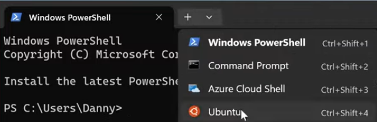
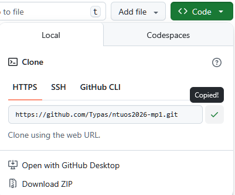
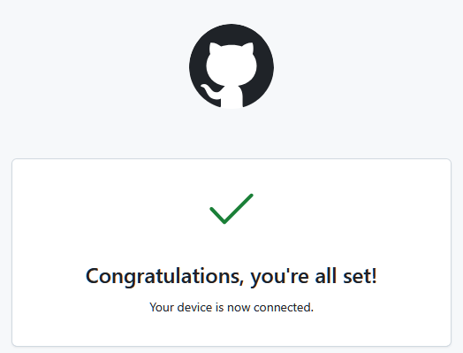
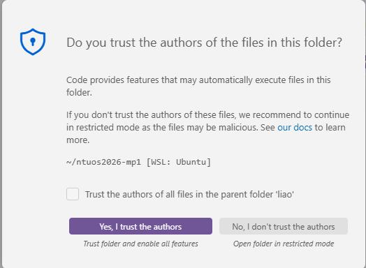

# 💻 Tips for Windows Users

This document provides recommendations and guidelines for Windows users to ensure a stable development environment and avoid common compatibility issues, such as CRLF line ending conflicts.

## 1. Recommended Tools and Environment

### Terminal

We strongly recommend installing [**Windows Terminal**](https://apps.microsoft.com/detail/9n0dx20hk701). It supports multiple profiles and offers excellent performance. After installation, refer to the [official tutorial](https://learn.microsoft.com/en-us/windows/terminal/install) for basic configuration.

### WSL2 Distro

We recommend using [**Ubuntu**](https://apps.microsoft.com/detail/9pdxgncfsczv) or [**Ubuntu LTS**](https://apps.microsoft.com/detail/9nz3klhxdjp5).

> [!IMPORTANT]
> Ensure that Docker Desktop has the **WSL 2 based engine** enabled.

### Editor

We recommend using [**VS Code**](https://code.visualstudio.com/) with the **WSL extension** installed. This allows you to edit files located within WSL directly from the Windows interface, avoiding path and encoding issues.

## 2. Core Rule: Avoid CRLF Issues

A common error when developing on Windows is the **automatic conversion of line endings from LF to CRLF**. If files (especially `./mp.sh`) are converted to CRLF, you will encounter errors when compiling or running scripts.

### Common Causes of CRLF

1. **Git for Windows**: The default configuration `core.autocrlf=true` automatically converts files during clone.
2. **WordPad** or older versions of Notepad.
3. **Visual Studio** (the IDE with the purple icon, not VS Code).

### 💡 Best Solution

**Perform all Git commands and file operations directly inside the WSL2 terminal.** Do not operate on the project directory from Windows PowerShell or CMD.

## 3. Step-by-Step Guide in WSL2

### Step 1: Enter WSL

In Windows Terminal, select the **Ubuntu** profile, or run the `wsl` command in any terminal.



### Step 2: Install Essential Packages

```bash
sudo apt update
sudo apt install git gh
```

> *This only needs to be done once*

### Step 3: Clone the Repository

1. Copy your repository URL from GitHub (HTTPS is recommended).



2. In WSL, execute:

   ```bash
   git clone <your_repo_url>
   cd ntuos2026-mpX
   ```

### Step 4: Login with GitHub CLI (`gh`)

This simplifies managing permissions for private repositories:

```bash
gh auth login
```

- Select: `GitHub.com` -> `HTTPS` -> `Login with a web browser`.
- Copy the 8-character code shown in the terminal, press Enter to open the browser (or Ctrl+click the link).
- Enter the code in the browser and authenticate until you see `✓ Logged in as YourUsername`.



### Step 5: Open with VS Code

In the repository root directory, run:

```bash
code .
```

The first time you open it, VS Code will install necessary server components in WSL. Select "Trust this folder" when prompted.



### Step 6: Ensure Docker is Running

Even if you are working inside WSL, **Docker Desktop** on your host machine must be in the "Running" state.

## 4. Useful Git Commands

Refer to the [Git Cheat Sheet](https://git-scm.com/cheat-sheet) for more commands.

- `git add .` : Stage changes.
- `git commit -m "your message"` : Save changes.
- `git push` : Upload to GitHub.
