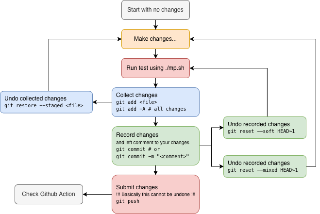

# 🔄 Submission & Grading Workflow Guide

Understand the cycle of development, testing, and official evaluation.

## 1. Local Testing: The Grader Logic

The `./mp.sh grade` command is your primary tool for verification. Here is how it works under the hood:

- **Automatic Scanning**: The grader scans the `tests/` directory for any `.py` (Python) or `.txt` (Shell script) files.
- **Unified Execution**: It identifies tests using decorators (like `@test`) or filename patterns.
- **Isolated Environment**: All tests are executed inside a Docker container, mounting your `xv6/` source code to ensure a clean build every time.

## 2. Creating Your Own Tests (The Sandbox)

We encourage you to create custom tests to catch edge cases. The `tests/` directory is your personal playground.

### How to Add a Test

You can create a simple shell-based test by adding a `.txt` file to `tests/`:

```bash
# tests/my_test.txt
# This script runs inside the xv6 shell
ls
echo "Testing my program..."
mp0 /
```

Or a Python-based test for complex logic:

```python
# tests/my_custom_test.py
from gradelib import *

@test(0, "my custom test description")
def test_my_logic():
    r.run_command("mp0 /")
    r.match("expected output")
```

### 🛠️ Troubleshooting Custom Tests

- **Hanging (Infinite Loops)**: If your test never finishes, check if your xv6 program is stuck in a loop. You can terminate the grader with `Ctrl+C`.
- **Garbage Output**: If your test produces massive amounts of text, it might slow down the grader. Try to keep outputs concise.
- **Binary Files**: Never put compiled binaries in the `tests/` folder; only source scripts.

## 3. Save and Upload (Git Commit & Push)

Git is an essential tool for version control and collaboration. For this assignment, you will use it to download, edit, and submit your code.

### 🛠️ Setting up Git Identity

Before you start, configure your basic Git information:

```bash
git config --global user.name "Your Name"
git config --global user.email "your-email@example.com"
```

### 📈 Development Lifecycle with Git

The following flowchart illustrates the typical commands you will use during development:

> [!WARNING]
> **Windows Users**: Before you start, ensure you are working **inside WSL2**. Running Git commands from Windows can automatically convert your line endings to CRLF, which will break the OS build. See [**Avoiding CRLF on Windows**](./tips-windows.md#2-core-rule-avoid-crlf-issues) for details.



1. Stage modified files (`git add`)

    ```bash
    git add xv6/user/mp0.c xv6/Makefile student.conf
    ```

    > *Tip: Use `git add .` to stage all modifications, but ensure no temporary or compiled files (like `fs.img`) are included.*

2. Save with a descriptive message (`git commit`)

    ```bash
    git commit -m "feat: complete basic requirements and configure student.conf"
    ```

3. Upload to the cloud (`git push`)

    ```bash
    git push origin <branch_name>
    ```

    *(e.g., `git push origin mp0`. Ensure you are pushing to the correct MP branch).*

### 🔍 Advanced Visualization: Git Graph

We strongly recommend installing the [**Git Graph**](https://marketplace.visualstudio.com/items?itemName=mhutchie.git-graph) extension. It provides a beautiful visual representation of your branch history and commits.

> [!TIP]
> Frequent commits are your best defense against data loss. Use `git commit` to save your progress incrementally!

## 4. GitHub Actions: Cloud Verification

Every time you `git push`, a cloud grading run is triggered automatically.

1. **Navigate** to your repository's **Actions** tab.
2. **Click** on the most recent workflow (likely named **Grading System**).
3. Under **Jobs** on the left, **click ✅ grade**.
4. **Expand Execute Tests (Grading)** to see the live console and detailed test results.
5. **Projected Score** 📈: The result shown in Actions mirrors your current progress on the **Public Tests**.
6. **Grade Summary** 📋: A formal report is also available in the workflow's **Summary** tab.

## 5. Official Grading & Academic Integrity

The most important thing to remember: **You cannot "break" the official grading by experimenting**.

- **The TA Sandbox**: TAs run final evaluations in a **pristine** environment, completely ignoring your custom tests or local configuration changes.
- **Safe to Mess Up**: Feel free to use the `tests/` directory for any debugging. It belongs to you, and it will not affect your grade.
- **Mandatory Privacy**: Your repository must remain **Private**. Public solution code is a severe violation of academic integrity and will result in a zero score.

### 📊 Grading Rubric

| Category               | Points       | Description                                                 |
| :--------------------- | :----------- | :---------------------------------------------------------- |
| **Public Testcases**   | *Varies*     | Visible in `tests/`, runnable via `./mp.sh grade`.          |
| **Private Testcases**  | *Varies*     | Hidden tests injected by TAs after the deadline.            |
| **Late Penalty**       | -20% / day   | Calculated from the TA's evaluation timestamp.              |
| **Identity Violation** | **0 Points** | Missing or default `student.conf` values.                   |
| **Security/Publicity** | **0 Points** | Repository set to public or tampering with grade isolation. |

### 🆔 Identity & Lateness

- **Identity**: If `student.conf` is invalid, your grade will be forced to **0** even if tests pass.

---

## 🔄 6. Staying Up to Date (Hot-Sync)

To ensure your development environment stays in sync with official specifications and test cases, we use a system called **Hot-Sync**. This system automatically alerts you whenever TAs release critical fixes or new requirements.

### ❓ What happens if I see a sync prompt?

When you run `./mp.sh` or use `git`, you might occasionally see a message asking you to sync.

1. **Don't panic**: Your code is safe.
2. **Press `y`**: This is usually the best choice. The system will handle the technical Git commands for you.
3. **Continue working**: Once finished, your assignment will be updated with the latest TA fixes, and your own code will be right where you left it.

### 🛡️ Why is it safe? (Snapshot Protection)

We know that losing hours of coding work is every student's nightmare. That's why the system follows a **"Safety First"** protocol:

- **Automatic Backups**: Before any sync begins, the system creates a **Snapshot**—a permanent backup of your current code in a separate branch (named `snapshot-YYYYMMDD-HHMMSS`).
- **Smart Merging**: The system automatically merges your code with the TA's updates. In the event of a conflict, files provided by TAs (like official documents, test cases or core configuration) take priority to ensure a valid grading environment.
- **Background Checks**: The system only checks for updates when you are actually using the tools, so it won't interrupt you while you're just typing code.

### 🔍 How to browse and restore snapshots?

If you need to check your previous work or if a sync resulted in unexpected behavior:

1. **List all snapshots**:

   ```bash
   git branch --list "snapshot-*"
   ```

2. **View code in a snapshot**: You can switch your workspace temporarily to see what it looked like:

   ```bash
   git checkout <snapshot_branch_name>
   ```

3. **Return to your assignment**:

   ```bash
   git checkout <assignment_branch> # e.g., git checkout mp0
   ```

### 🛠️ Manual Controls

While the system is mostly automatic, you can take control using these commands:

- **Force an update check**:

  ```bash
  ./mp.sh sync
  ```

- **Create a manual backup**: If you're about to try something risky, create your own snapshot first:

  ```bash
  ./mp.sh snapshot
  ```

- **Restore a backup**: Use standard Git to go back to any snapshot if needed: `git checkout <snapshot_branch_name>`.

> ***A Final Defense**: Hot-Sync is your safety net, but it doesn't replace regular commits. We strongly recommend using `git commit` often to save your progress incrementally.*
